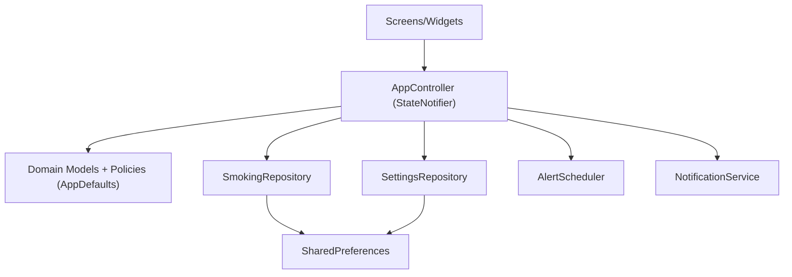

# Smoke Timer 기술 설계/검증 보고서 (ISO 대응)

- 문서 버전: `v1.0`
- 작성일: `2026-02-21`
- 대상 시스템: `Smoke Timer (Flutter)`
- 기준 표준: `ISO 9001`, `ISO/IEC 25010`, `ISO/IEC 12207`

---

## 1. 요구사항 정의서

### 1.1 목적
Smoke Timer 앱의 현재 구현 상태(다크모드, 로컬라이제이션, 알림 미리알림 슬라이더 포함)를 기준으로, 품질 프로세스와 소프트웨어 품질 특성을 명시적으로 관리 가능한 수준으로 구조화한다.

### 1.2 범위
- 앱 레이어: UI, 상태관리, 도메인 정책, 로컬 저장소, 로컬 알림, 광고 모듈
- 플랫폼: Android/iOS
- 데이터 저장: 로컬(SharedPreferences)
- 외부 백엔드 API: 없음 (내부 서비스 인터페이스 중심)

### 1.3 품질 표준 매핑

| 표준 | 적용 대상 | 본 문서 반영 항목 |
|---|---|---|
| ISO 9001 | 품질경영 프로세스 | 요구사항-설계-검증-유지보수 추적 구조, 변경/릴리즈 체크리스트 |
| ISO/IEC 25010 | 품질 특성 | 기능적합성, 신뢰성, 사용성, 성능효율성, 보안성, 유지보수성, 이식성 |
| ISO/IEC 12207 | 생명주기 | 요구사항, 아키텍처/상세설계, 구현, 시험, 운영/유지보수 활동 정의 |

### 1.4 기능/비기능 요구사항

| ID | 유형 | 요구사항 | 수용 기준 |
|---|---|---|---|
| FR-01 | 기능 | 흡연 기록 추가/되돌리기 | 기록 추가/롤백 후 상태/저장소/알림 재계산 일치 |
| FR-02 | 기능 | 알림 설정(반복, 간격, 미리알림, 허용시간, 요일) | 변경 즉시 저장 및 다음 알림 프리뷰 반영 |
| FR-03 | 기능 | 다크모드 토글 | 즉시 ThemeMode 반영 + 재시작 후 유지 |
| FR-04 | 기능 | 다국어(ko/en) 표시 | locale에 따라 설정/다크모드 라벨 변경 |
| NFR-01 | 신뢰성 | 예외 시 앱 크래시 방지 | guarded 실행 + fallback 상태 유지 |
| NFR-02 | 유지보수성 | 정책 상수화/의존성 분리 | AppDefaults + Provider DI + 서비스 인터페이스 |
| NFR-03 | 성능효율성 | 불필요 연산/리빌드 최소화 | select/watch 최적화, 정렬/계산 경로 통제 |
| NFR-04 | 보안성 | 민감설정 주입 분리 | 광고 ID는 `--dart-define`로 주입 |
| NFR-05 | 사용성/접근성 | 다양한 해상도/텍스트 스케일 안정성 | matrix widget test 무오류 |

### 1.5 사전 위험 분석 (에러 발생 가능 지점)

| 위험 지점 | 원인 | 영향 | 예방/완화 |
|---|---|---|---|
| SharedPreferences payload 손상 | JSON 파싱 실패 | 설정/기록 로드 실패 | 기본값 fallback + warning/error 로깅 |
| 알림 권한 미허용 | 사용자/OS 정책 | 알림 미동작 | 명시적 권한 요청 흐름 + 안내 메시지 |
| Exact alarm 제한(Android) | 시스템 제한 | 정확도 저하 | inexact 스케줄 폴백 |
| 빈번한 상태 변경 | 과도한 리렌더링 | 프레임 드랍 가능 | selector 기반 watch, 정책 상수화 |
| locale 키 누락 | 번역 누락 | 문구 불일치 | fallback locale + key 반환 정책 |

---

## 2. 기능 명세서

### 2.1 기능 목록

| 기능 그룹 | 세부 기능 | 입력 | 출력 | 상태 변화 |
|---|---|---|---|---|
| Onboarding | 건너뛰기/완료 | 사용자 탭 | 메인 진입 | `hasCompletedOnboarding=true` |
| Home | 지금 흡연 기록 | 탭 | 기록 +1 | records/meta 갱신, 알림 재스케줄 |
| Home | 되돌리기 | 탭 | 최근 기록 제거 | records/meta 갱신, 알림 재스케줄 |
| Record | 오늘/주간/월간 필터 | 탭 | 요약/목록 재계산 | `recordPeriod` 변경 |
| Settings | 다크모드 토글 | 탭 | 테마 즉시 반영 | `darkModeEnabled` 저장 |
| Alert Settings | 미리 알림 슬라이더(0~15) | 슬라이더 값 | `N분 전` 표시 | `preAlertMinutes` 저장/재스케줄 |
| Cost Settings | 가격/개비수/통화 | 입력/선택 | 비용 요약 반영 | 설정 저장 |
| Reset | 데이터 초기화 | 확인 탭 | 온보딩 복귀 | 저장소/알림 전체 초기화 |

### 2.2 상태 전이 요약
- `splash -> onboarding/main`: bootstrap + meta 기반
- 알림 관련 설정 변경: `_updateSettings(..., reschedule: true)` 경로
- 화면 테마 전환: `darkModeEnabled -> MaterialApp.themeMode`

---

## 3. 시스템 아키텍처 설계

### 3.1 논리 아키텍처



### 3.2 컴포넌트 설계(확장성/유지보수성)

| 컴포넌트 | 책임 | SOLID 관점 |
|---|---|---|
| `AppController` | 유스케이스 오케스트레이션 | SRP(상태 조정), DIP(인터페이스 의존) |
| `SettingsRepository` | 설정/메타 영속화 | SRP, OCP(스키마 확장 대응) |
| `SmokingRepository` | 기록 영속화/정렬 | SRP |
| `AlertScheduler` | 알림 시각 계산 정책 | SRP, 테스트 용이성 |
| `NotificationService` | 플랫폼 알림 추상화 | DIP, LSP(구현 교체 가능) |
| `AppDefaults` | 정책 상수 관리 | 매직넘버 제거, 중복 정책 방지 |

### 3.3 보안/성능 설계 포인트
- 보안:
  - 광고 ID는 환경 주입(`--dart-define`)으로 분리
  - 로컬 데이터는 민감 개인정보 최소화 저장
- 성능:
  - 반복 정렬/계산 경로 최소화
  - 리액티브 갱신은 필요한 필드만 watch/select
  - 알림 계산 시 guard limit으로 무한 루프 방지

---

## 4. 데이터 구조 설계

### 4.1 도메인 모델

| 엔터티 | 필드 | 제약/정책 |
|---|---|---|
| `SmokingRecord` | `id:String`, `timestamp:DateTime`, `count:int` | `count>=1`, timestamp desc 정렬 저장 |
| `AppMeta` | `hasCompletedOnboarding:bool`, `lastSmokingAt:DateTime?` | 온보딩 흐름 결정 |
| `UserSettings` | interval/preAlert/repeat/window/weekdays/24h/ring/vibration/sound/cost/currency/darkMode | 정책 상수 범위 내 정규화 |
| `AppState` | stage/init/now/records/settings/meta/period/nextAlertAt | 단일 source of truth |
| `ScheduledAlert` | `id:int`, `at:DateTime`, `title`, `body` | 스케줄 등록 payload |

### 4.2 저장소 키 설계

| 저장 키 | 설명 | 형식 |
|---|---|---|
| `smoking_records_json` | 흡연 기록 배열 | JSON List |
| `user_settings_json` | 사용자 설정 | JSON Object |
| `app_meta_json` | 앱 메타 | JSON Object |

### 4.3 데이터 진화 정책
- 신규 필드 추가 시 `fromJson(..., defaults:)`로 하위호환 유지
- 손상 payload는 예외 전파 대신 기본값 fallback

---

## 5. API 명세

> 본 시스템은 외부 HTTP API 대신 내부 서비스 API(유스케이스 인터페이스)를 중심으로 동작한다.

### 5.1 AppController 유스케이스 API

| API ID | 메서드 | 입력 | 출력 | 부작용 | 오류 처리 |
|---|---|---|---|---|---|
| UC-01 | `bootstrap()` | 없음 | `Future<void>` | state 초기화, 로드, 알림 재등록 | guarded + fallback stage |
| UC-02 | `addSmokingRecord()` | 없음 | `Future<void>` | record/meta 저장, 알림 재스케줄 | 실패 시 이전 state 롤백 |
| UC-03 | `undoLastRecord()` | 없음 | `Future<void>` | record/meta 저장, 알림 재스케줄 | 실패 시 이전 state 롤백 |
| UC-04 | `toggleDarkMode()` | 없음 | `Future<void>` | settings 저장 | reschedule=false |
| UC-05 | `setPreAlertMinutes(int)` | `0..15` 권장 | `Future<void>` | settings 저장, 알림 재스케줄 | 범위 클램프 |
| UC-06 | `toggleRepeatEnabled()` | 없음 | `Future<bool>` | 권한 요청, settings 저장 | 권한 미허용 시 false |
| UC-07 | `resetAllData()` | 없음 | `Future<void>` | 저장소 clear + 알림 cancel | 실패 시 예외 로깅/재전파 |

### 5.2 Repository/Service 계약 API

| 인터페이스 | 메서드 | 목적 |
|---|---|---|
| `SmokingRepository` | `loadRecords/saveRecords/clear` | 기록 데이터 영속화 |
| `SettingsRepository` | `loadSettings/saveSettings/loadMeta/saveMeta/clear` | 설정/메타 영속화 |
| `NotificationService` | `initialize/requestPermission/scheduleAlerts/showTest/cancelAll` | 플랫폼 알림 추상화 |
| `AlertScheduler` | `buildUpcomingAlerts/alignToAllowedWindow/isAllowedDateTime` | 알림 시각 계산 |

---

## 6. 예외 처리 정책

### 6.1 예외 분류

| 분류 | 예시 타입 | 코드 예시 | 정책 |
|---|---|---|---|
| 저장소 예외 | `RepositoryException` | `records_save_failed` | 로깅 + 롤백/기본값 |
| 알림 예외 | `NotificationOperationException` | `schedule_platform_exception` | exact→inexact 폴백 후 재시도 |
| 비정상 예외 | `Exception` | N/A | `_runGuarded`에서 공통 로깅 |

### 6.2 공통 처리 규칙
1. 사용자 체감 기능 우선: 가능한 경우 graceful degradation
2. 상태 일관성 우선: 실패 시 이전 state 복구
3. 로깅 표준화: namespace + level + optional error/stack
4. 보안 준수: 로그에 민감정보(개인식별자, 토큰) 기록 금지

### 6.3 보안 취약점 고려
- 광고 ID/운영 설정값 하드코딩 금지
- 권한 요청은 사용자 명시 액션 기반으로 제한
- 입력값(가격/개비/시간범위)은 정책 기반 정규화

### 6.4 성능 병목 분석
- 잠재 병목:
  - 대규모 records 정렬/필터 반복
  - 1초 ticker로 인한 과도한 재빌드
- 완화:
  - 파생값 계산 함수 분리 및 재사용
  - selector 기반 watch로 재빌드 범위 축소
  - 스케줄러 guard limit

---

## 7. 테스트 케이스

### 7.1 품질 특성별 테스트 매트릭스

| 품질 특성(25010) | 검증 항목 | 근거 테스트 |
|---|---|---|
| 기능적합성 | 기록 추가/되돌리기, 설정 저장 | home/settings/cost/alert tests |
| 신뢰성 | 예외 발생 시 동작 유지 | repository fallback + guarded flow tests |
| 사용성 | onboarding, tab 이동, locale 표시 | onboarding/tabs/localization tests |
| 성능효율성 | 다양한 해상도/스케일 안정성 | ui_stability_matrix, galaxy_audit |
| 보안성 | 환경변수 주입/권한 정책 | ad_ids/ad_service/notification tests |
| 유지보수성 | 모듈 단위 테스트 가능 구조 | services/repositories unit tests |

### 7.2 핵심 테스트 케이스

| TC ID | 시나리오 | 절차 | 기대 결과 |
|---|---|---|---|
| TC-001 | 다크모드 영속성 | Settings에서 ON → 재시작 | ThemeMode dark 유지 |
| TC-002 | 로컬라이제이션 ko/en | locale 변경 | `다크 모드`/`Dark Mode` 정확 표시 |
| TC-003 | 미리알림 슬라이더 | 12→0 조정 | settings 값 반영, UI 레이블 변경 |
| TC-004 | 반응형 안정성 | viewport/textScale matrix 순회 | overflow/clipping/out-of-bounds 없음 |
| TC-005 | 알림 권한 미허용 | 반복알림 ON 시도 | false 반환, 앱 비정상 종료 없음 |
| TC-006 | 데이터 초기화 | reset 실행 | 저장소 키 제거 + onboarding 복귀 |

---

## 8. 코드 구현

> 아래 코드는 현재 아키텍처 원칙(SOLID, DI, 상수화, 로깅, 테스트 용이성)을 유지하는 참조 구현 예시이다.

```dart
/// Pre-alert 정책 상수와 정규화 로직을 캡슐화한다.
class PreAlertPolicy {
  static const int minMinutes = 0;
  static const int maxMinutes = 15;

  /// 입력 값을 정책 범위(min~max)로 정규화한다.
  static int normalize(int value) {
    return value.clamp(minMinutes, maxMinutes).toInt();
  }
}

/// 설정 영속화 포트(의존성 역전)를 정의한다.
abstract interface class SettingsPort {
  /// 현재 사용자 설정을 조회한다.
  Future<UserSettings> loadSettings();

  /// 사용자 설정을 저장한다.
  Future<void> saveSettings(UserSettings settings);
}

/// 구조화 로그 포트를 정의한다.
abstract interface class LogPort {
  /// 정보성 로그를 출력한다.
  void info(String message);

  /// 오류 로그를 출력한다.
  void error(String message, {Object? error, StackTrace? stackTrace});
}

/// 미리 알림 분(minute) 변경 유스케이스.
class UpdatePreAlertMinutesUseCase {
  UpdatePreAlertMinutesUseCase({
    required SettingsPort settingsPort,
    required LogPort logger,
  }) : _settingsPort = settingsPort,
       _logger = logger;

  final SettingsPort _settingsPort;
  final LogPort _logger;

  /// 미리 알림 분 값을 검증/정규화 후 저장한다.
  Future<UserSettings> execute(int requestedMinutes) async {
    final current = await _settingsPort.loadSettings();
    final normalized = PreAlertPolicy.normalize(requestedMinutes);

    if (current.preAlertMinutes == normalized) {
      _logger.info('pre-alert unchanged: $normalized');
      return current;
    }

    final updated = current.copyWith(preAlertMinutes: normalized);
    await _settingsPort.saveSettings(updated);
    _logger.info('pre-alert updated: $normalized');
    return updated;
  }
}
```

### 구현 원칙 적용 요약
- 하드코딩/매직넘버 제거: 정책 상수 클래스 사용
- 중복 로직 제거: normalize 로직 단일화
- 의존성 분리: Port(interface) 주입
- 테스트 가능: UseCase 단위 mock 검증 가능
- 로깅 구조 포함: `LogPort`로 일관성 확보

---

## 9. 코드 검증 리포트

### 9.1 실행 명령 및 결과

| 항목 | 명령 | 결과 |
|---|---|---|
| 정적 분석 | `flutter analyze` | `No issues found!` |
| 테스트 | `flutter test` | `All tests passed!` |
| 테스트 수 | `flutter test` 로그 기준 | 총 `60` 테스트 통과 |

### 9.2 품질 판정 (ISO 관점)

| 품질 항목 | 판정 | 근거 |
|---|---|---|
| 기능적합성 | 적합 | 주요 플로우(홈/기록/설정/알림/비용) 회귀 통과 |
| 신뢰성 | 적합 | guarded 실행, fallback, 롤백 정책 존재 |
| 유지보수성 | 적합 | 레이어 분리, DI, 정책 상수화 |
| 보안성 | 부분 적합 | 로컬 앱 특성상 비밀정보 적음, 환경변수 분리 적용 |
| 성능효율성 | 적합 | 반응형/접근성 매트릭스 테스트 통과 |

### 9.3 잔여 리스크
- 로컬 저장소 기반 특성상 다중 디바이스 동기화 요구에는 부적합
- 장기적으로 기록량이 매우 커질 경우(수만 건) 리스트/통계 최적화 필요
- 알림 동작은 OS 정책 변경(정확 알람 제한)에 영향을 받을 수 있음

---

## 10. 유지보수 가이드

### 10.1 변경 관리 절차 (ISO 9001/12207 정렬)
1. 변경 요구 등록: 목적/영향/리스크 정의
2. 영향도 분석: 기능, 데이터, 알림 정책, 테스트 범위
3. 설계 승인: 아키텍처/데이터/API/예외정책 검토
4. 구현: 상수화/중복 제거/DI 준수
5. 검증: analyze + test + 수동 QA
6. 릴리즈: 브랜치 정책 준수 후 merge

### 10.2 코딩 표준 체크리스트
- [ ] 하드코딩 값 제거 (`AppDefaults`/설정 객체로 이동)
- [ ] 매직넘버 제거 (상수화)
- [ ] 중복 로직 제거 (서비스/유틸 재사용)
- [ ] DI 준수 (Provider/인터페이스)
- [ ] 모든 public 함수 목적 주석 작성
- [ ] 예외 지점 사전 분석 및 로그 포함
- [ ] 보안/성능 영향 검토 코멘트 포함

### 10.3 운영 가이드
- 장애 징후:
  - 알림 미동작: 권한/정확 알림 허용 여부 점검
  - 설정 초기화: 저장소 payload 손상 여부 확인
- 1차 대응:
  - 로그 namespace별 확인(`bootstrap`, `app-controller`, `settings-repo`, `notifications`)
  - 재현 시나리오와 입력값(시간대, locale, 텍스트 스케일) 기록

### 10.4 확장 로드맵
- 로컬 DB 도입(SQLite/Isar)으로 대용량 기록 최적화
- 로컬라이제이션 전면 확장(전체 하드코딩 문자열 제거)
- 알림/통계 도메인 UseCase 분리 강화(클린 아키텍처 심화)

